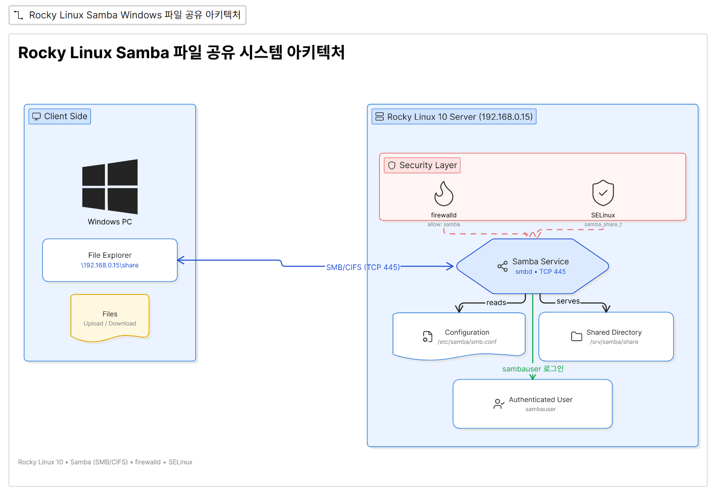
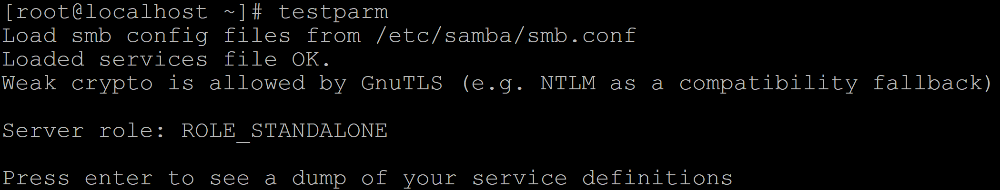
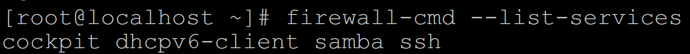
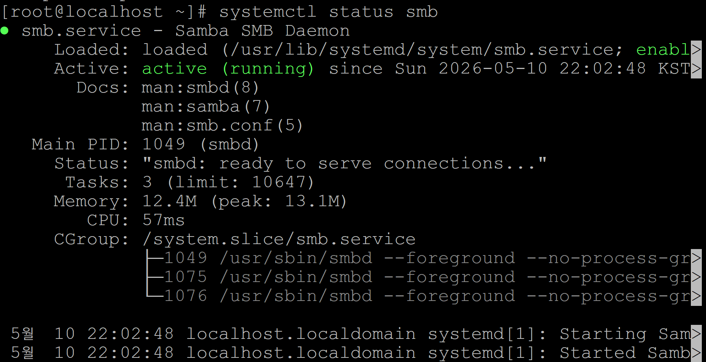
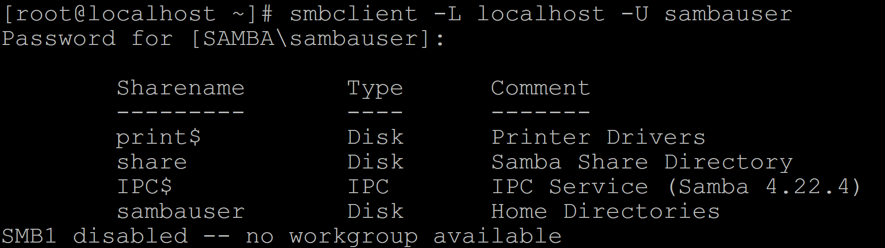
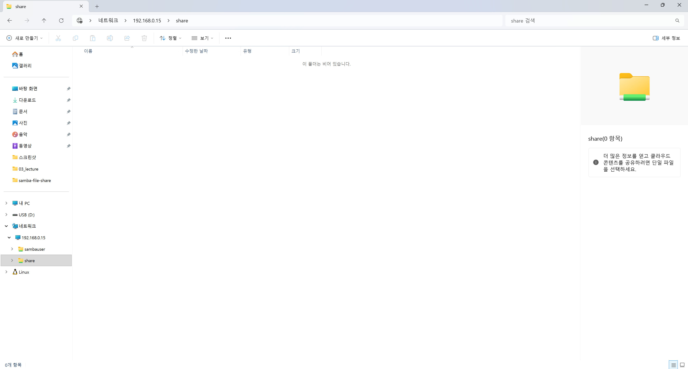

# Samba 파일 공유 실습

Rocky Linux에서 Samba를 설정하여 Windows와 파일을 공유한 실습 기록입니다.

이번 실습에서는 Linux 서버의 `/srv/samba/share` 디렉터리를 Windows에서 `\\192.168.0.15\share`로 접속할 수 있도록 구성했습니다.

---

## 시스템 아키텍처

<p align="center">
  
</p>

---

## 실습 환경

| 항목 | 내용 |
|------|------|
| 운영체제 | Rocky Linux 10 |
| 서버 IP | `192.168.0.15` |
| 공유 디렉터리 | `/srv/samba/share` |
| Samba 사용자 | `sambauser` |
| 접속 주소 | `\\192.168.0.15\share` |

---

## 프로젝트 구조

```text
samba-file-share/
├── README.md
├── smb.conf
└── screenshots/
    ├── system-architecture.png
    ├── 01-testparm.png
    ├── 02-firewall.png
    ├── 03-smb-status.png
    ├── 04-smbclient-list.png
    └── 05-windows-access-success.png
```

---

## 1. Samba 설치

```bash
dnf install -y samba samba-client
```

---

## 2. 공유 디렉터리 생성

```bash
mkdir -p /srv/samba/share
chmod 777 /srv/samba/share
```

---

## 3. 사용자 생성 및 등록

```bash
useradd sambauser
passwd sambauser
smbpasswd -a sambauser
```

---

## 4. Samba 설정

`/etc/samba/smb.conf` 파일 마지막에 다음 내용을 추가했습니다.

```ini
[share]
    comment = Samba Share Directory
    path = /srv/samba/share
    browseable = yes
    read only = no
    writable = yes
    guest ok = no
    valid users = sambauser
    create mask = 0777
    directory mask = 0777
```

---

## 5. 설정 확인

```bash
testparm
```



---

## 6. 방화벽 설정

```bash
firewall-cmd --permanent --add-service=samba
firewall-cmd --reload
firewall-cmd --list-services
```



---

## 7. Samba 서비스 실행

```bash
systemctl enable smb
systemctl start smb
systemctl status smb
```



---

## 8. 공유 목록 확인

```bash
smbclient -L localhost -U sambauser
```

`share`가 표시되면 설정이 정상적으로 적용된 것입니다.



---

## 9. Windows에서 접속

Windows 파일 탐색기 주소창에 다음 경로를 입력합니다.

```text
\\192.168.0.15\share
```

- 사용자명: `sambauser`
- 비밀번호: `smbpasswd -a sambauser`에서 설정한 비밀번호



---

## 문제 해결 과정

### `share`가 보이지 않았던 문제

처음에는 `smbclient -L localhost -U sambauser` 결과에 `share`가 나타나지 않아 Windows에서 접속할 수 없었습니다.

원인은 `/etc/samba/smb.conf`에 `[share]` 설정이 제대로 저장되지 않았기 때문이었습니다.

설정을 다시 추가한 후 아래 명령어를 실행하여 문제를 해결했습니다.

```bash
testparm
systemctl restart smb
smbclient -L localhost -U sambauser
```

---

## 자주 사용한 명령어

```bash
testparm
firewall-cmd --list-services
systemctl status smb
pdbedit -L
smbclient -L localhost -U sambauser
ls -ld /srv/samba/share
```

---

## 배운 내용

- Samba를 이용한 Linux-Windows 파일 공유
- `smb.conf` 설정 방법
- 방화벽 설정
- Samba 서비스 관리
- Windows 네트워크 공유 접속
- GitHub 문서화

---

## 작성자

- GitHub: https://github.com/SanghyeokLee-KR
